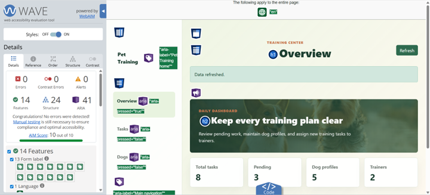
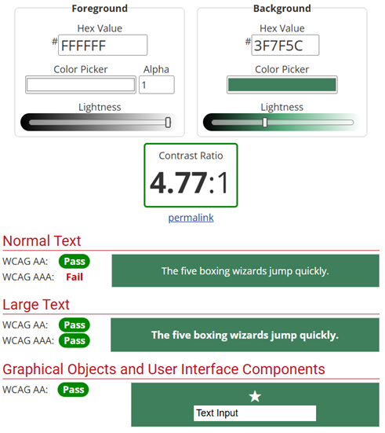

# 🐾 Dog Training Task Manager

A web application for managing dog training tasks, supporting two user roles — Admin and Employee — to help training organizations efficiently assign and track each dog's training progress.

---

## Project Overview

This project is a task management system designed for pet training businesses. Admins can manage employees, dogs, and training tasks all in one place. Regular employees can view all tasks for any dog, but can only edit tasks assigned to themselves.

---

## Features

### Admin

- View, create, update, and delete all tasks
- View, create, update, and delete all dogs
- View task assignments across all employees

### Employee

- Edit only **tasks assigned to themselves**
- Cannot delete tasks or manage other employees' data
- View dogs' data

---

## Tech Stack

| Layer               | Technology                       |
| ------------------- | -------------------------------- |
| Backend Framework   | Node.js + Express                |
| Database            | MongoDB + Mongoose               |
| Authentication      | JWT (JSON Web Token)             |
| Password Encryption | bcrypt                           |
| Template Engine     | Express Handlebars               |
| Frontend            | Vanilla JavaScript + Bootstrap 5 |

---

## Database Models

The project has three core data models:

- **User** — Stores name, email, password; the `role` (admin or employee)
- **Dog** — Stores name, breed, age, owner, photo, and notes
- **Task** — Stores title, description, status, priority, due date, and references to a dog and a trainer.

---

## API Routes

### Auth

| Method | Route              | Access    |
| ------ | ------------------ | --------- |
| POST   | /api/auth/register | Public    |
| POST   | /api/auth/login    | Public    |
| GET    | /api/auth/trainers | Protected |

### Dogs

| Method | Route         | Access     |
| ------ | ------------- | ---------- |
| GET    | /api/dogs     | Protected  |
| POST   | /api/dogs     | Admin only |
| PUT    | /api/dogs/:id | Admin only |
| DELETE | /api/dogs/:id | Admin only |

### Tasks

| Method | Route             | Access                    |
| ------ | ----------------- | ------------------------- |
| GET    | /api/tasks        | Protected                 |
| GET    | /api/tasks/:id    | Protected                 |
| POST   | /api/tasks/create | Admin only                |
| PATCH  | /api/tasks/:id    | Admin or assigned trainer |
| DELETE | /api/tasks/:id    | Admin only                |

---

## Getting Started

1. Clone the repository
2. Run `npm install`
3. Create a `.env` file and add your MongoDB URI and JWT secret:

```
MONGODB_URI=your_mongodb_uri
JWT_TOKEN=your_secret_key
PORT=5000
```

4. Run `npm start`
5. Open `http://localhost:5000`

---

## ♿ Accessibility Documentation

> Step-by-step guide for student

This section describes how accessibility was considered and implemented in the Pet Training web application, with a focus on screen-reader accessibility. It documents features, testing tools, testing results, team responsibilities, and notes for GitHub.

### 1. Summary of Accessibility Approach

We applied semantic HTML, ARIA attributes where appropriate, explicit labels for form controls, keyboard focus management, and clear states for dynamic components so that screen reader users can navigate and interact with the application.

### 2. Implemented Accessibility Features

#### Semantic HTML structure and landmark roles

The main layout (`views/index.handlebars`) uses HTML5 semantic elements to provide a meaningful document structure that assistive technologies can navigate efficiently. The sidebar uses `<aside>`, the primary content area uses `<main>`, navigation uses `<nav>`, and the top bar uses `<header>`. On the Dogs page, the profile list area and the form area are each wrapped in a `<section>` / `<aside>` with `role="region"` and `aria-labelledby`, giving each region a distinct name.

#### Navigation label and button state (`aria-label`, `aria-pressed`)

The sidebar navigation is marked up as `<nav aria-label="Main">`. The word "navigation" is intentionally omitted from the label value because the `<nav>` element already carries that role — including it would cause some screen readers to announce the redundant phrase "Main navigation, navigation".

The three navigation buttons (Overview / Tasks / Dogs) convey their active state through `aria-pressed="true"` / `"false"`. The initial state is written directly in the HTML, and the JavaScript `setSection()` function synchronises the attribute whenever the active tab changes. This means a screen reader user tabbing through the menu hears, for example, "Overview, pressed, button" or "Tasks, not pressed, button", giving them a clear sense of which section is currently displayed.

#### Form labels and validation

All form inputs include `<label for=>` associations and `invalid-feedback` blocks are present. Examples in the task and dog forms: labels for `task-title`, `task-dog`, `task-assigned-to`, and others.

#### ARIA attributes on interactive controls

Buttons created dynamically include `aria-label` attributes (e.g., `Delete task: X`, `Edit task: X`) which supply descriptive names for actions announced by screen readers.

#### Modal dialogs (delete confirmation)

The application includes two independent confirmation dialogs: `delete-task-modal` and `delete-dog-modal`. Both use the same ARIA pattern, and their warning paragraphs have deliberately separate IDs. The two warning paragraphs use the IDs `delete-task-warning` and `delete-dog-warning` respectively, ensuring each dialog's `aria-describedby` resolves to the correct element.

#### Focus management and keyboard flow

When opening forms (new/edit), code moves focus to the first input (task title or dog form title). When forms are closed, focus returns to the triggering button (New Task). This helps keyboard and screen-reader users maintain context.

#### Skip link

On the Dogs page, a skip link is placed immediately after the section heading. Its target is the form title element `#dog-form-title`. The link is visually hidden by default using a `clip-path`. When the element receives keyboard focus, it is restored to its natural size and full opacity at its static document-flow position. Without this shortcut, a user would need to Tab through every dog card's Edit and Delete buttons before reaching the form.

#### Context-rich `aria-label` on dynamically generated buttons

When tabbing to Edit and Delete buttons in the task list, the screen reader reads out the task context dynamically — for example, "Edit task: {Task1}, button".

#### ARIA state attributes for navigation

Navigation buttons use `aria-pressed` and `aria-current` so screen readers can announce which section is active.

#### Decorative images handled appropriately

Dog photos are rendered as background images and marked with `aria-hidden="true"` to avoid noisy announcements. Textual information such as the dog name is provided as a heading.

#### Live region for messages

The app message element uses `role="alert"` so success/error messages are announced to screen readers when content changes.

### 3. Concrete Code Examples and Where to Find Them

Key implementations are located in the project files:

**`views/index.handlebars`** — Sidebar brand link with accessible label:

```html
<a class="sidebar-brand" href="/" aria-label="Pet Training home">
  <span class="brand-dot"></span><span>Pet Training</span>
</a>
```

Dynamically generated task button with context-rich label:

```html
<button
  class="btn btn-outline-success btn-sm"
  type="button"
  data-action="edit-task"
  data-id="${escapeHtml(idOf(task))}"
  aria-label="Edit task: ${taskTitle}"
  ${canEdit ? "" : "disabled"}
>Edit</button>
```
**`public/app.js`**

```html
<div class="task-row-actions">
  <button 
  class="btn btn-outline-success btn-sm" 
  type="button" data-action="edit-task" 
  data-id="${escapeHtml(idOf(task))}" 
  aria-label="Edit task: ${taskTitle}" ${canEdit ? "" : "disabled"}>Edit</button>
  ${deleteButton}
</div>
```

### 4. Evaluation and Testing

The following tools were used during accessibility evaluation:

| Tool | Purpose |
| ---- | ------- |
| [WAVE browser extension](https://wave.webaim.org/) | Structural accessibility audit |
| NVDA | Screen reader testing |
| [WebAIM Contrast Checker](https://webaim.org/resources/contrastchecker/) | Color contrast verification |

**WAVE tool results:** 


**Color contrast results:** 

### 5. Observed Issues and Challenges

During testing, several areas for improvement were identified:

- **Color contrast:** The color-contrast checker showed that most combinations passed WCAG AA and AAA, but one AAA-level contrast failed and should be reviewed to ensure consistent accessibility across all UI elements.

- **Dynamically generated cards (NVDA):** NVDA revealed that dynamically generated cards are not announced in a meaningful way. For example, when navigating the Dogs page with Tab, NVDA only reports "edit/delete dog [name] button," without describing the image or the card's content. This makes newly added dogs difficult to understand for screen-reader users and requires improved accessible names or ARIA descriptions. The Tasks page contains the same issue.

- **WAVE summary:** The WAVE extension reported no critical issues and gave an AIM score of 10/10, indicating strong overall structural accessibility, though the above issues still need attention.

### 6. Team Responsibilities

| Member | Accessibility Responsibilities |
| ------ | ------------------------------ |
| Toni Näsman | WAVE extension and screen reader (NVDA) testing |
| Jiawei Li | Form labels, ARIA attributes, and color contrast |

### 7. Use of AI

AI tools were used to help draft and format this documentation. All technical claims were checked against the project source files.

### 8. GitHub Notes

README.md in GitHub repository: [https://github.com/T0ntsa/BackendProject](https://github.com/T0ntsa/BackendProject)
